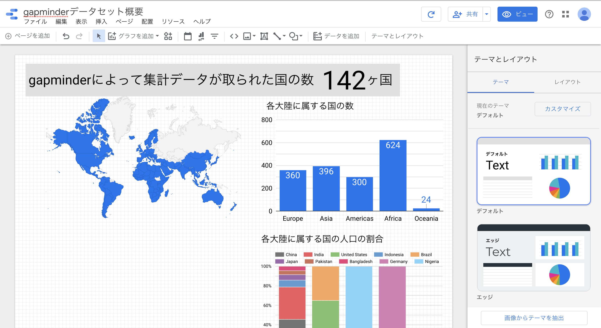

## Dash製のデータ分析簡易ダッシュボードを作りたい

---?gitpitch_assets/plotlydash.png&position=right&size=55% 100%

## Dashとはなんぞや

- FlaskベースのWebフレームワーク
- Plotly.js, React.jsで動いている
- データ可視化、グラフ描画、ダッシュボード作成

---

### とはいえ,,,

---

## すでに優秀な環境がある

- Tableau
- Google Data Portal
- Amazon QuickSight

+++

### Tableau

- 様々な形式から分析、可視化、ダッシュボード、プレゼン
- pdf,csv,exel,データベースサーバー

[参考](https://www.tableau.com/)

+++

### Google Data Portal

Googleサービスの情報を一括閲覧可能

- Google Analytics
- Google BigQuery

[参考](https://marketingplatform.google.com/intl/ja/about/data-studio/)

+++

+++

### Amazon QuickSight

  

- 高性能計算エンジン「SPICE」
- SageMakerによる高度なインサイト
- S3, Salesforce等から分析可能

[参考](https://aws.amazon.com/jp/quicksight/features/)

+++

+++

+++