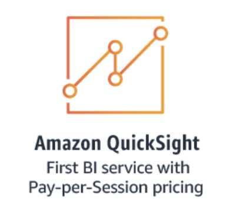
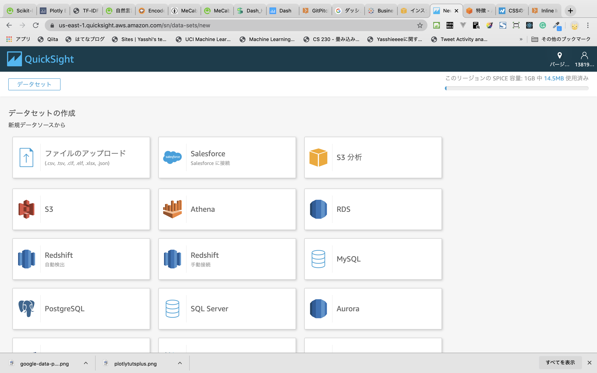
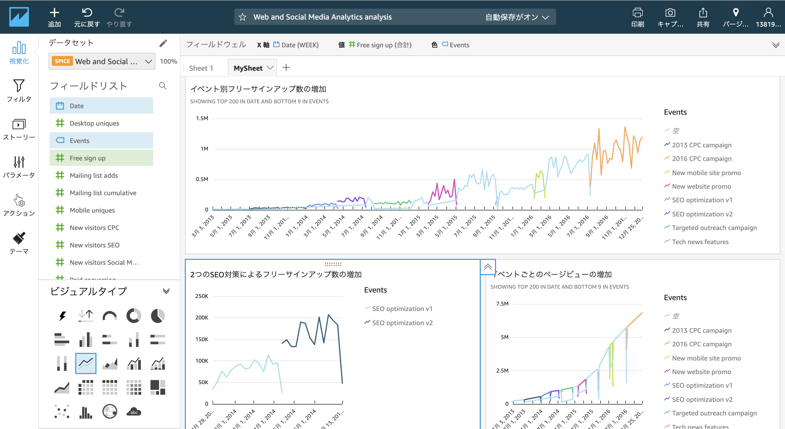

## Dashとはなんぞや

- FlaskベースのWebフレームワーク
- Plotly.js, React.jsで動いている
- データ可視化、グラフ描画、ダッシュボード作成

---

### とはいえ,,,

---

## ダッシュボードといえば優秀なBI環境がある

- Tableau
- Google Data Portal
- Amazon QuickSight

+++

### Tableau

- 様々なデータ形式から分析、可視化、ダッシュボード作成、プレゼンまで可能
    - pdf,csv,exel,データベースサーバー

参考：https://www.tableau.com/

+++

### Google Data Portal

- Google各種サービスの情報を一括閲覧可能
    - Google Analytics
    - Google Ad
    - Google BigQuery

参考：https://marketingplatform.google.com/intl/ja/about/data-studio/

+++

### Amazon QuickSight

- 高性能計算エンジン「SPICE」
- SageMakerを利用した高度なインサイト
- AWS各種サービス、外部等から分析が開始できる
    - S3
    - Athena
    - Salesforce

+++

+++

+++

参考：https://aws.amazon.com/jp/quicksight/features/